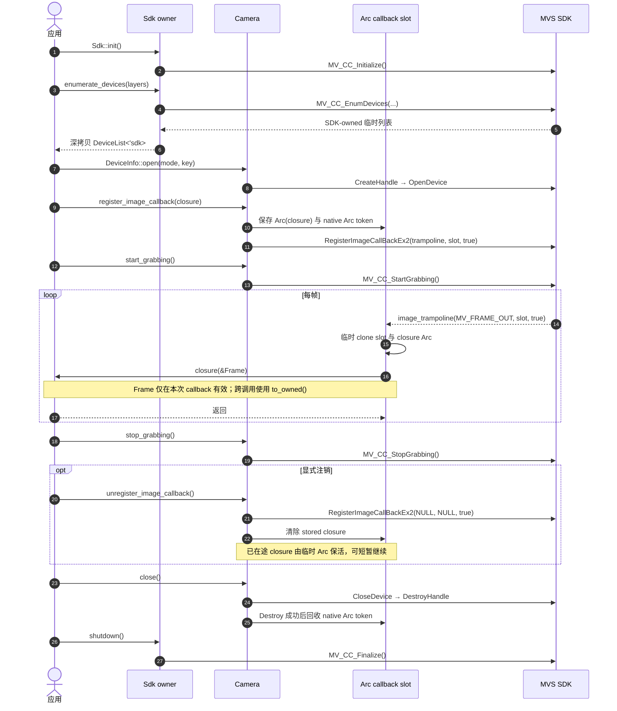

# Callback 取流

```mermaid
sequenceDiagram
    autonumber
    actor App as 应用
    participant Sdk as Sdk owner
    participant Camera as Camera
    participant Slot as Arc callback slot
    participant Native as MVS SDK

    App->>Sdk: Sdk::init()
    Sdk->>Native: MV_CC_Initialize()
    App->>Sdk: enumerate_devices(layers)
    Sdk->>Native: MV_CC_EnumDevices(...)
    Native-->>Sdk: SDK-owned 临时列表
    Sdk-->>App: 深拷贝 DeviceList<'sdk>

    App->>Camera: DeviceInfo::open(mode, key)
    Camera->>Native: CreateHandle → OpenDevice
    App->>Camera: register_image_callback(closure)
    Camera->>Slot: 保存 Arc(closure) 与 native Arc token
    Camera->>Native: RegisterImageCallBackEx2(trampoline, slot, true)
    App->>Camera: start_grabbing()
    Camera->>Native: MV_CC_StartGrabbing()

    loop 每帧
        Native-->>Slot: image_trampoline(MV_FRAME_OUT, slot, true)
        Slot->>Slot: 临时 clone slot 与 closure Arc
        Slot->>App: closure(&Frame)
        Note over Slot,App: Frame 仅在本次 callback 有效；跨调用使用 to_owned()
        App-->>Slot: 返回
    end

    App->>Camera: stop_grabbing()
    Camera->>Native: MV_CC_StopGrabbing()
    opt 显式注销
        App->>Camera: unregister_image_callback()
        Camera->>Native: RegisterImageCallBackEx2(NULL, NULL, true)
        Camera->>Slot: 清除 stored closure
        Note over Camera,Slot: 已在途 closure 由临时 Arc 保活，可短暂继续
    end

    App->>Camera: close()
    Camera->>Native: CloseDevice → DestroyHandle
    Camera->>Slot: Destroy 成功后回收 native Arc token
    App->>Sdk: shutdown()
    Sdk->>Native: MV_CC_Finalize()
```

callback 只做通知或复制数据，停止、关闭和重连交给 `Camera` owner。closure panic 在
trampoline 最外层截获，Arc 的析构也不会跨越 FFI 边界。
