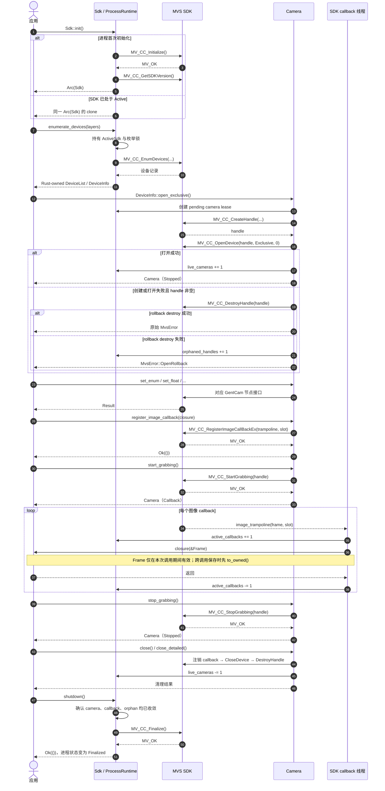

# Callback 取流

本图记录从 SDK 初始化、枚举并打开相机，到 callback 取流、关闭相机及 SDK shutdown
的完整调用顺序。

```mermaid
sequenceDiagram
    autonumber
    actor App as 应用
    participant Sdk as Sdk / ProcessRuntime
    participant Native as MVS SDK
    participant Camera as Camera
    participant Thread as SDK callback 线程

    App->>Sdk: Sdk::init()
    alt 进程首次初始化
        Sdk->>Native: MV_CC_Initialize()
        Native-->>Sdk: MV_OK
        Sdk->>Native: MV_CC_GetSDKVersion()
        Sdk-->>App: Arc(Sdk)
    else SDK 已处于 Active
        Sdk-->>App: 同一 Arc(Sdk) 的 clone
    end

    App->>Sdk: enumerate_devices(layers)
    Sdk->>Sdk: 持有 ActiveSdk 与枚举锁
    Sdk->>Native: MV_CC_EnumDevices(...)
    Native-->>Sdk: 设备记录
    Sdk-->>App: Rust-owned DeviceList / DeviceInfo

    App->>Camera: DeviceInfo::open_exclusive()
    Camera->>Sdk: 创建 pending camera lease
    Camera->>Native: MV_CC_CreateHandle(...)
    Native-->>Camera: handle
    Camera->>Native: MV_CC_OpenDevice(handle, Exclusive, 0)
    alt 打开成功
        Camera->>Sdk: live_cameras += 1
        Camera-->>App: Camera（Stopped）
    else 创建或打开失败且 handle 非空
        Camera->>Native: MV_CC_DestroyHandle(handle)
        alt rollback destroy 成功
            Camera-->>App: 原始 MvsError
        else rollback destroy 失败
            Camera->>Sdk: orphaned_handles += 1
            Camera-->>App: MvsError::OpenRollback
        end
    end

    App->>Camera: set_enum / set_float / ...
    Camera->>Native: 对应 GenICam 节点接口
    Native-->>App: Result

    App->>Camera: register_image_callback(closure)
    Camera->>Native: MV_CC_RegisterImageCallBackEx(trampoline, slot)
    Native-->>Camera: MV_OK
    Camera-->>App: Ok(())

    App->>Camera: start_grabbing()
    Camera->>Native: MV_CC_StartGrabbing(handle)
    Native-->>Camera: MV_OK
    Camera-->>App: Camera（Callback）

    loop 每个图像 callback
        Native-->>Thread: image_trampoline(frame, slot)
        Thread->>Sdk: active_callbacks += 1
        Thread->>App: closure(&Frame)
        Note over Thread,App: Frame 仅在本次调用期间有效；跨调用保存时先 to_owned()
        App-->>Thread: 返回
        Thread->>Sdk: active_callbacks -= 1
    end

    App->>Camera: stop_grabbing()
    Camera->>Native: MV_CC_StopGrabbing(handle)
    Native-->>Camera: MV_OK
    Camera-->>App: Camera（Stopped）

    App->>Camera: close() / close_detailed()
    Camera->>Native: 注销 callback → CloseDevice → DestroyHandle
    Camera->>Sdk: live_cameras -= 1
    Camera-->>App: 清理结果

    App->>Sdk: shutdown()
    Sdk->>Sdk: 确认 camera、callback、orphan 均已收敛
    Sdk->>Native: MV_CC_Finalize()
    Native-->>Sdk: MV_OK
    Sdk-->>App: Ok(())，进程状态变为 Finalized
```

