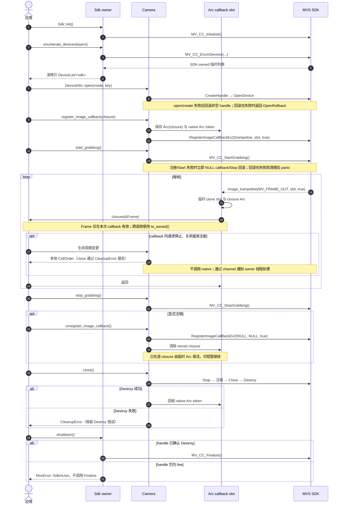

# Callback 取流

```mermaid
sequenceDiagram
    autonumber
    actor App as 应用
    participant Sdk as Sdk owner
    participant Camera as Camera
    participant Slot as Arc callback slot
    participant Native as MVS SDK

    App->>Sdk: Sdk::init()
    Sdk->>Native: MV_CC_Initialize()
    App->>Sdk: enumerate_devices(layers)
    Sdk->>Native: MV_CC_EnumDevices(...)
    Native-->>Sdk: SDK-owned 临时列表
    Sdk-->>App: 深拷贝 DeviceList<'sdk>

    App->>Camera: DeviceInfo::open(mode, key)
    Camera->>Native: CreateHandle → OpenDevice
    Note over Camera,Native: open/create 失败后回滚非空 handle；回滚也失败时返回 OpenRollback
    App->>Camera: register_image_callback(closure)
    Camera->>Slot: 保存 Arc(closure) 与 native Arc token
    Camera->>Native: RegisterImageCallBackEx2(trampoline, slot, true)
    App->>Camera: start_grabbing()
    Camera->>Native: MV_CC_StartGrabbing()
    Note over Camera,Native: 注册/Start 失败时立即 NULL callback/Stop 回滚；回滚也失败则清理后 panic

    loop 每帧
        Native-->>Slot: image_trampoline(MV_FRAME_OUT, slot, true)
        Slot->>Slot: 临时 clone slot 与 closure Arc
        Slot->>App: closure(&Frame)
        Note over Slot,App: Frame 仅在本次 callback 有效；跨调用使用 to_owned()
        opt callback 内请求停止、关闭或改注册
            App->>Camera: 生命周期变更
            Camera-->>App: 本地 CallOrder（close 通过 CleanupError 报告）
            Note over Camera,Native: 不调用 native；通过 channel 通知 owner 线程处理
        end
        App-->>Slot: 返回
    end

    App->>Camera: stop_grabbing()
    Camera->>Native: MV_CC_StopGrabbing()
    opt 显式注销
        App->>Camera: unregister_image_callback()
        Camera->>Native: RegisterImageCallBackEx2(NULL, NULL, true)
        Camera->>Slot: 清除 stored closure
        Note over Camera,Slot: 已在途 closure 由临时 Arc 保活，可短暂继续
    end

    App->>Camera: close()
    Camera->>Native: Stop → 注销 → Close → Destroy
    alt Destroy 成功
        Camera->>Slot: 回收 native Arc token
    else Destroy 失败
        Camera-->>App: CleanupError（保留 Destroy 错误）
    end
    App->>Sdk: shutdown()
    alt handle 已确认 Destroy
        Sdk->>Native: MV_CC_Finalize()
    else handle 仍为 live
        Sdk-->>App: MvsError::SdkInUse，不调用 Finalize
    end
```

callback 只做通知或复制数据，停止、关闭和重连交给 `Camera` owner。callback 内的
生命周期变更以本地 `CallOrder` 拒绝，不会进入 native SDK。closure panic 在 trampoline
最外层截获并静默该 closure，owner 注销后可重新注册；Arc 的析构不会跨越 FFI 边界。
