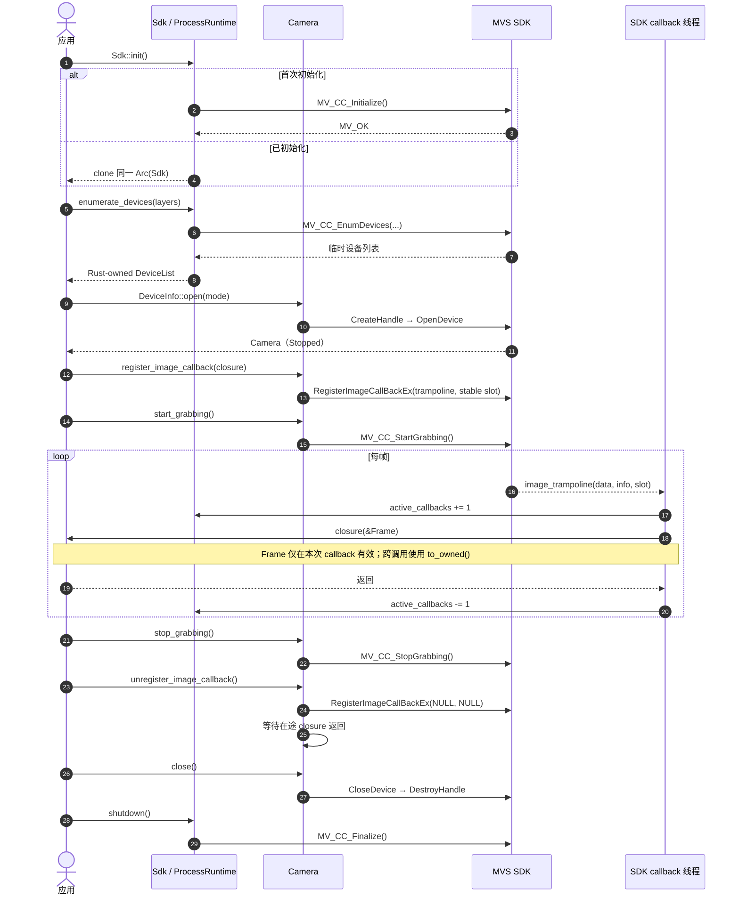

# Callback 取流

```mermaid
sequenceDiagram
    autonumber
    actor App as 应用
    participant Sdk as Sdk / ProcessRuntime
    participant Camera as Camera
    participant Native as MVS SDK
    participant Thread as SDK callback 线程

    App->>Sdk: Sdk::init()
    alt 首次初始化
        Sdk->>Native: MV_CC_Initialize()
        Native-->>Sdk: MV_OK
    else 已初始化
        Sdk-->>App: clone 同一 Arc(Sdk)
    end

    App->>Sdk: enumerate_devices(layers)
    Sdk->>Native: MV_CC_EnumDevices(...)
    Native-->>Sdk: 临时设备列表
    Sdk-->>App: Rust-owned DeviceList

    App->>Camera: DeviceInfo::open(mode)
    Camera->>Native: CreateHandle → OpenDevice
    Native-->>App: Camera（Stopped）

    App->>Camera: register_image_callback(closure)
    Camera->>Native: RegisterImageCallBackEx(trampoline, stable slot)
    App->>Camera: start_grabbing()
    Camera->>Native: MV_CC_StartGrabbing()

    loop 每帧
        Native-->>Thread: image_trampoline(data, info, slot)
        Thread->>Sdk: active_callbacks += 1
        Thread->>App: closure(&Frame)
        Note over Thread,App: Frame 仅在本次 callback 有效；跨调用使用 to_owned()
        App-->>Thread: 返回
        Thread->>Sdk: active_callbacks -= 1
    end

    App->>Camera: stop_grabbing()
    Camera->>Native: MV_CC_StopGrabbing()
    App->>Camera: unregister_image_callback()
    Camera->>Native: RegisterImageCallBackEx(NULL, NULL)
    Camera->>Camera: 等待在途 closure 返回

    App->>Camera: close()
    Camera->>Native: CloseDevice → DestroyHandle
    App->>Sdk: shutdown()
    Sdk->>Native: MV_CC_Finalize()
```

callback 负责通知或复制数据，Camera 的停止、关闭和重连由 owner 线程执行。closure panic
在 trampoline 内截获，并停用对应 slot。

