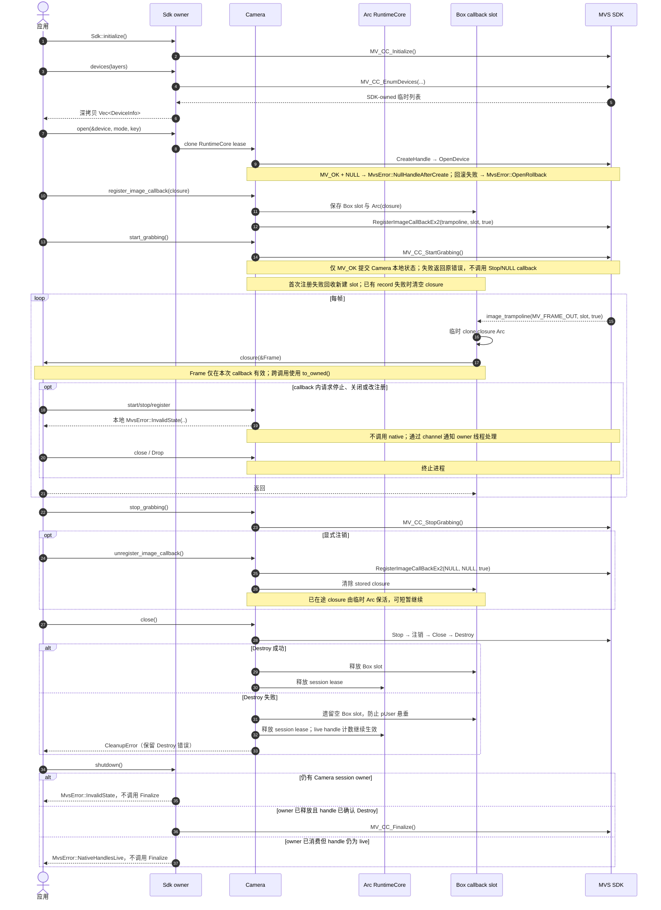

# Callback 取流

callback 只做通知或复制数据，停止、关闭和重连交给 `Camera` owner。callback 内的
start/stop/register 以本地 `MvsError::InvalidState(..)` 拒绝，不会进入 native SDK；
`close` / `Drop` 终止进程。业务错误通过 channel 交给 owner。closure panic 在 trampoline
终止进程。Camera 本地状态只在调用返回 `MV_OK` 后更新；Start、Stop、注册和注销失败时
owner 仍在，由调用方决定是否重试。`Camera` 内部 session lease 与 callback closure Arc
职责独立。`close(self)` 与 `shutdown(self)` 都会消费 owner 并只尝试一次，错误只用于诊断
和宿主策略。
