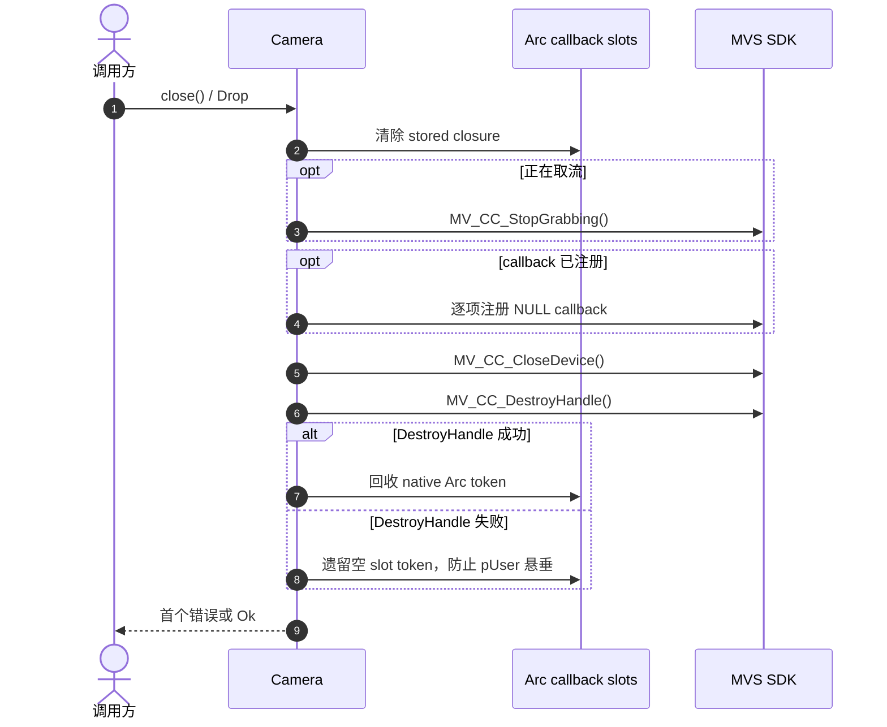

# Camera 显式关闭与 Drop 兜底

```mermaid
sequenceDiagram
    autonumber
    actor Caller as 调用方
    participant Camera as Camera
    participant Slots as Arc callback slots
    participant Native as MVS SDK

    Caller->>Camera: close() / Drop
    Camera->>Slots: 清除 stored closure
    opt 正在取流
        Camera->>Native: MV_CC_StopGrabbing()
    end
    opt callback 已注册
        Camera->>Native: 逐项注册 NULL callback
    end
    Camera->>Native: MV_CC_CloseDevice()
    Camera->>Native: MV_CC_DestroyHandle()
    alt DestroyHandle 成功
        Camera->>Slots: 回收 native Arc token
    else DestroyHandle 失败
        Camera->>Slots: 遗留空 slot token，防止 pUser 悬垂
    end
    Camera-->>Caller: 首个错误或 Ok
```

单步失败不打断后续清理，`DestroyHandle` 始终最后执行。显式 `close` 返回首个错误；
`Drop` 走同一路径并忽略结果。Destroy 失败只遗留对应的空 callback slot，不再把整个
SDK 永久标记为 in-use。
