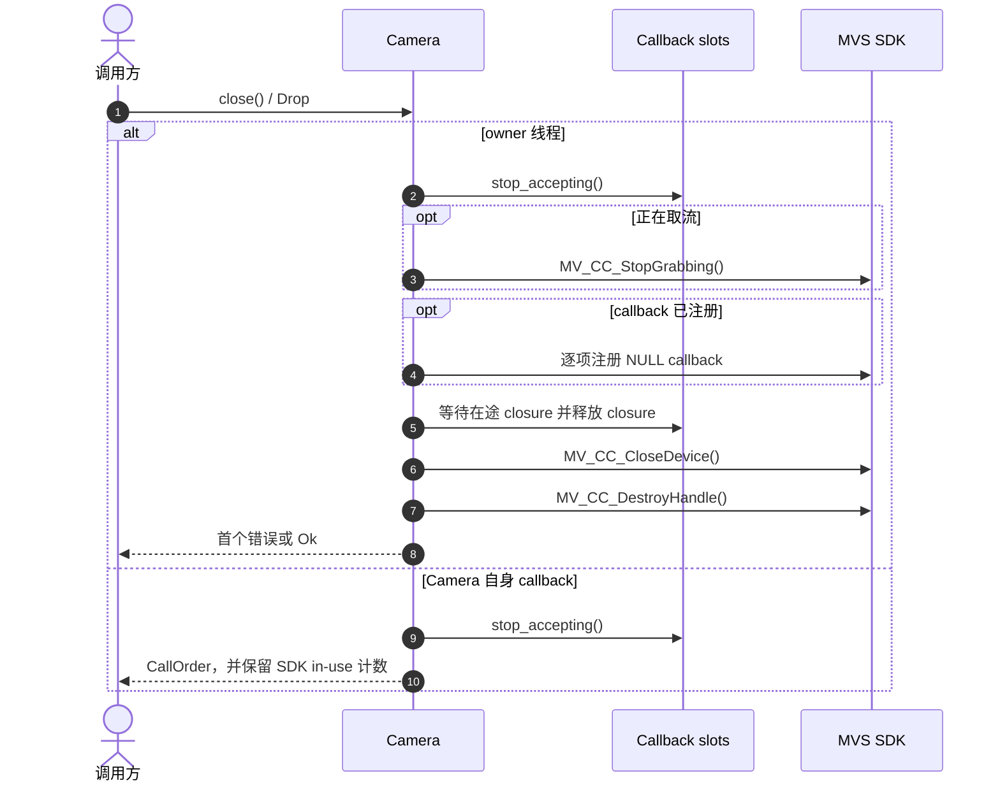

# Camera 显式关闭与 Drop 兜底

owner 线程上的单步失败不会中断后续清理，`DestroyHandle` 是最后一步。显式 `close` 返回
首个错误；`Drop` 执行同一路径并忽略结果。若 callback 间接析构自己的 Camera，wrapper
会停用 slot、保留 native backing 与 SDK in-use 计数；标准用法由 owner 线程关闭 Camera。
