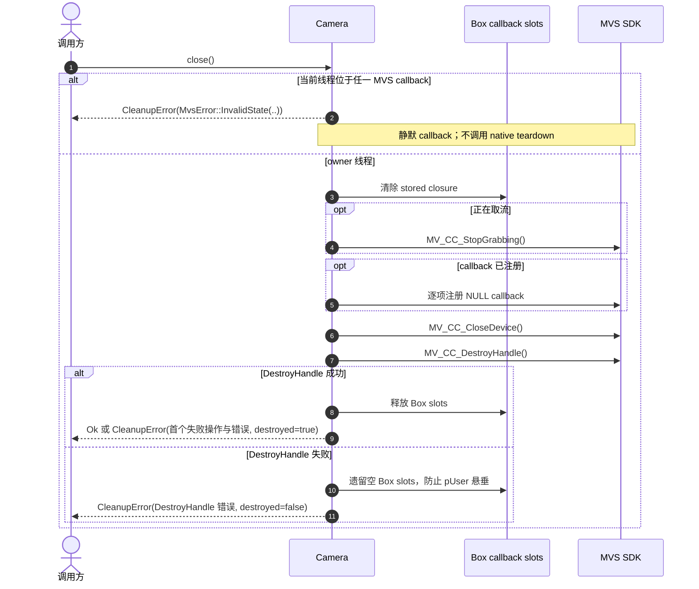

# Camera 显式关闭与 Drop 兜底

单步失败不打断后续清理，`DestroyHandle` 始终最后执行。显式 `close(self)` 会消费 Camera
并只尝试一次；`CleanupError` 分别保留 Destroy 前首个失败操作与错误、独立的
Destroy 错误和 handle 是否已确认销毁。返回错误后不能用同一 Camera 重试，结果只用于
诊断和宿主策略。Destroy 失败时保留 live handle 状态与空 callback slot，`Sdk::shutdown`
因 live handle 返回 `MvsError::NativeHandlesLive`，不调用 Finalize。

`Drop` 在普通 owner 线程走相同 teardown 并忽略错误；若当前线程位于任一 MVS callback，
只静默 callback，不重入 native 生命周期接口，live handle 继续阻止 Finalize。wrapper 不增加
callback drain；普通 owner teardown 依赖 SDK 的 Stop、Close、Destroy 同步约定，`Arc` 只保活
已经进入 Rust 的 closure。
