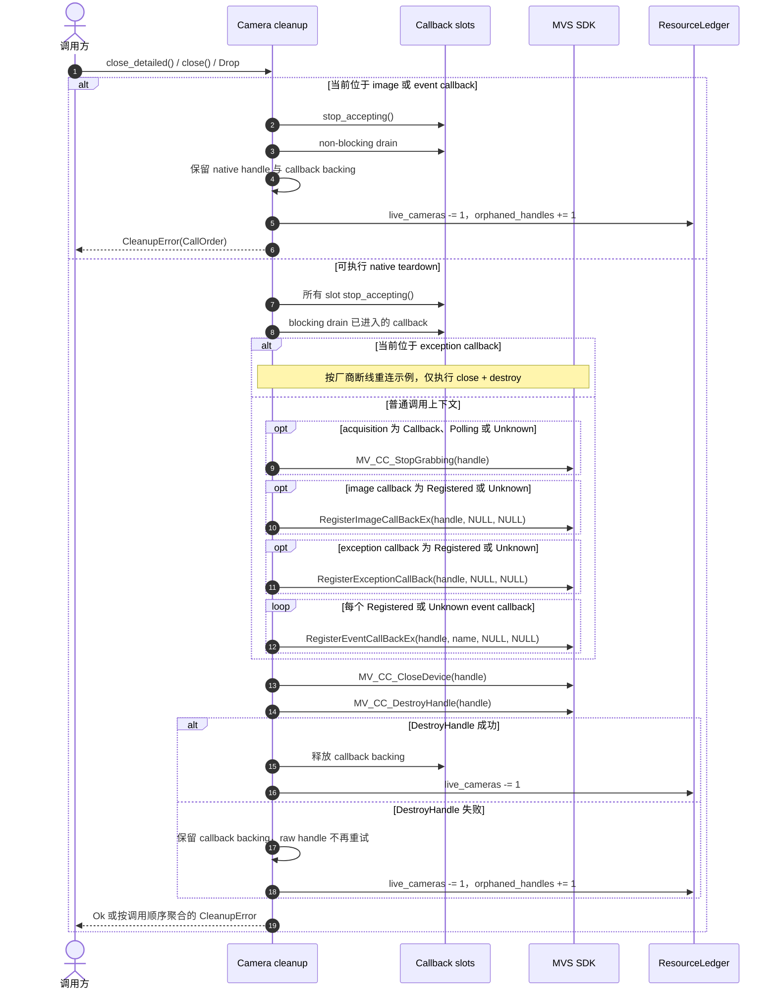

# Camera 显式关闭与 Drop 兜底

本图记录 `Camera` 显式关闭及 `Drop` 兜底时，callback、native handle 与资源账本的清理顺序。

清理会在单步失败后继续执行，尽量到达 `DestroyHandle`。一旦 native handle 的销毁结果
无法确认，wrapper 会保留 SDK 可能继续引用的内存，并阻止进程级 finalize，防止 callback
访问已释放内存。

