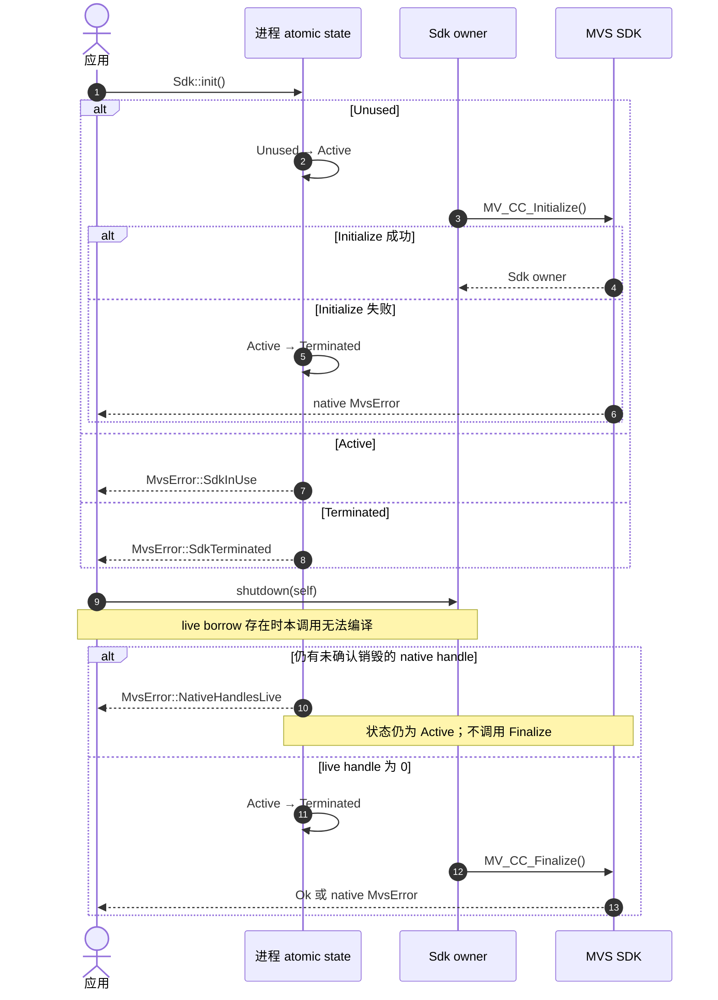

# Sdk shutdown 的终态约束

`Sdk` 是进程内唯一 owner。正常的 `DeviceList<'sdk>`、`DeviceInfo<'sdk>` 与
`Camera<'sdk>` 借用它，因此 Rust 会在编译期阻止这些资源存活时消费 `Sdk`。此外，
CreateHandle 写出的每个非空 handle 都计为 live，只有 DestroyHandle 成功才解除。
以下状态机只用于 Windows x86_64 MSVC；unsupported 目标不调用 native Initialize，也不进入
进程终态，每次 `Sdk::init` 均返回 `UnsupportedPlatform`。

官方 CHM 限定单进程仅执行一次 Initialize 与 Finalize。Windows native Initialize 失败或 Finalize 尝试后
均进入终态，后续 `Sdk::init` 返回 `SdkTerminated`；失败路径不重试 native 调用。
Open rollback 或 Camera cleanup 未确认 DestroyHandle 成功时，live handle 门禁优先阻止
Finalize。`shutdown(self)` 会消费 owner 并只尝试一次，错误用于诊断和宿主策略，不能用同一
owner 重试；`Drop` 执行相同兜底并忽略错误。
