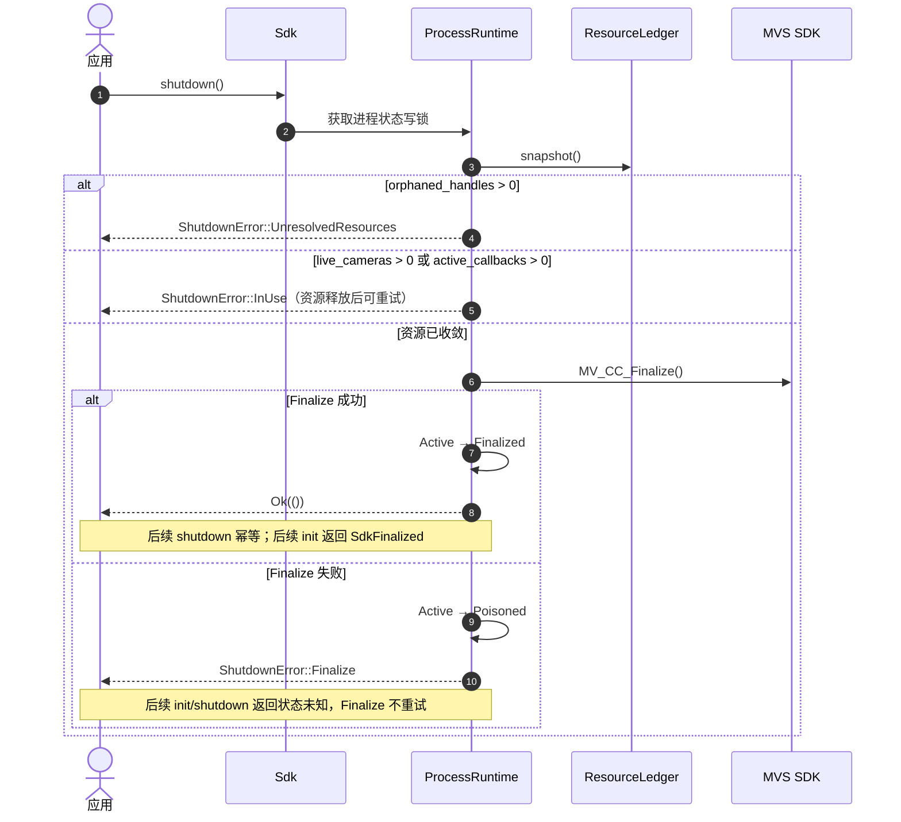

# Sdk shutdown 的终态约束

`Sdk::shutdown` 获取进程状态写锁，因此会等待已经取得 `ActiveSdk` read guard 的 SDK 操作
结束。资源检查通过后才进入 `MV_CC_Finalize`。

```mermaid
sequenceDiagram
    autonumber
    actor App as 应用
    participant Sdk as Sdk
    participant Runtime as ProcessRuntime
    participant Ledger as ResourceLedger
    participant Native as MVS SDK

    App->>Sdk: shutdown()
    Sdk->>Runtime: 获取进程状态写锁
    Runtime->>Ledger: snapshot()
    alt orphaned_handles > 0
        Runtime-->>App: ShutdownError::UnresolvedResources
    else live_cameras > 0 或 active_callbacks > 0
        Runtime-->>App: ShutdownError::InUse（资源释放后可重试）
    else 资源已收敛
        Runtime->>Native: MV_CC_Finalize()
        alt Finalize 成功
            Runtime->>Runtime: Active → Finalized
            Runtime-->>App: Ok(())
            Note over App,Runtime: 后续 shutdown 幂等；后续 init 返回 SdkFinalized
        else Finalize 失败
            Runtime->>Runtime: Active → Poisoned
            Runtime-->>App: ShutdownError::Finalize
            Note over App,Runtime: 后续 init/shutdown 返回状态未知，Finalize 不重试
        end
    end
```

