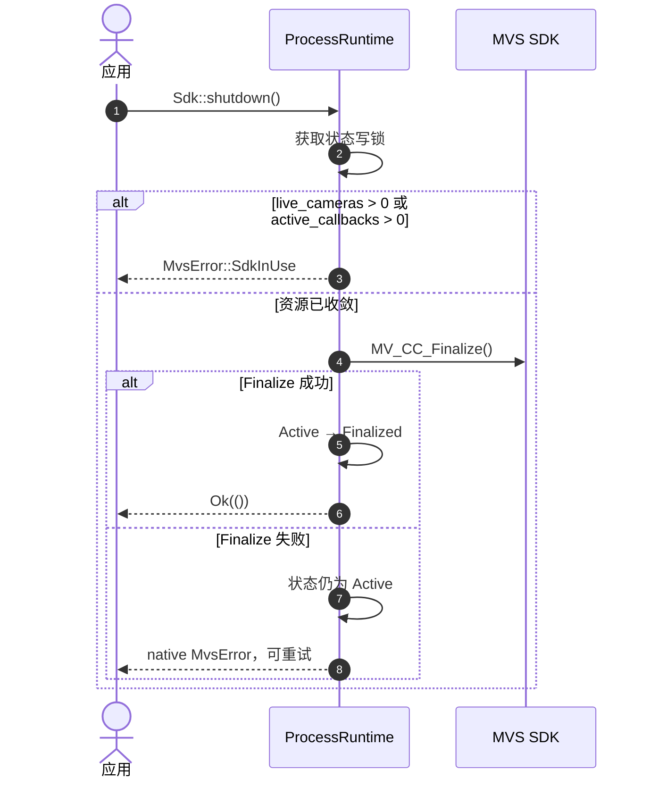

# Sdk shutdown 的终态约束

`Sdk::shutdown` 与初始化、枚举和设备打开通过进程状态锁串行。简单资源计数只回答一个
问题：相机 handle 或 callback 是否仍在使用 SDK；销毁失败的 handle 会保留一次计数。

```mermaid
sequenceDiagram
    autonumber
    actor App as 应用
    participant Runtime as ProcessRuntime
    participant Native as MVS SDK

    App->>Runtime: Sdk::shutdown()
    Runtime->>Runtime: 获取状态写锁
    alt live_cameras > 0 或 active_callbacks > 0
        Runtime-->>App: MvsError::SdkInUse
    else 资源已收敛
        Runtime->>Native: MV_CC_Finalize()
        alt Finalize 成功
            Runtime->>Runtime: Active → Finalized
            Runtime-->>App: Ok(())
        else Finalize 失败
            Runtime->>Runtime: 状态仍为 Active
            Runtime-->>App: native MvsError，可重试
        end
    end
```

成功 shutdown 后重复调用仍返回 `Ok(())`，后续 `Sdk::init` 返回 `SdkFinalized`。
