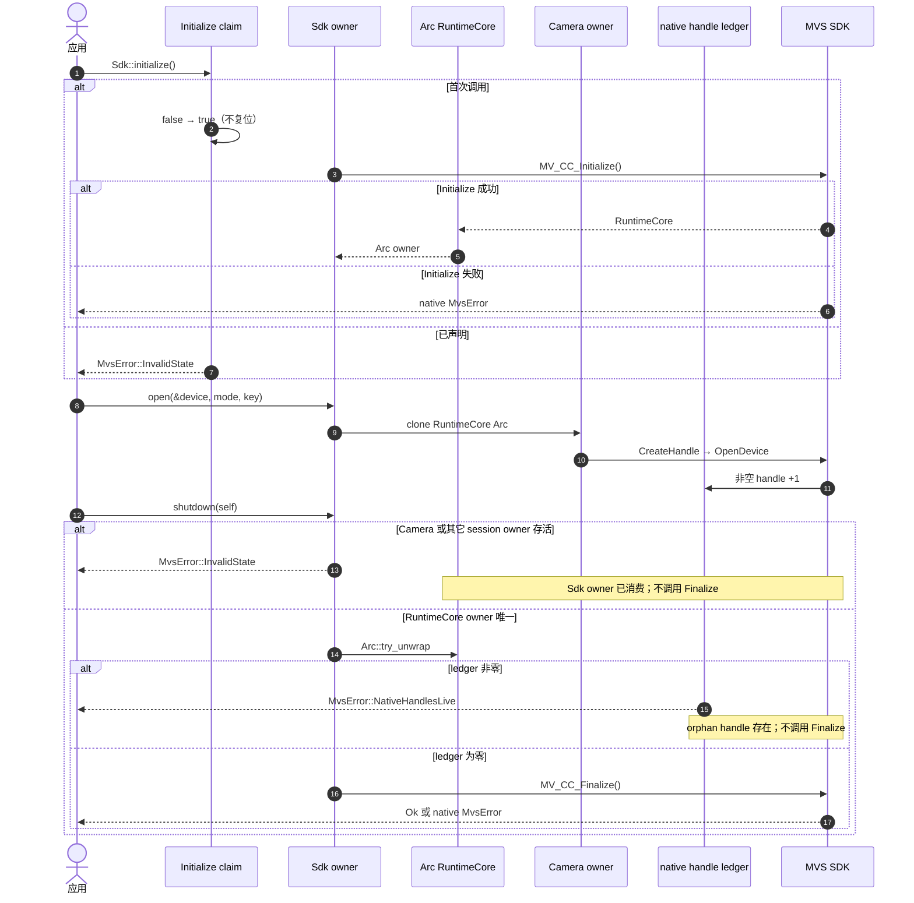

# Sdk shutdown 的终态约束

`Sdk` 与每个已打开 `Camera` 通过 `Arc<RuntimeCore>` 持有一次性 native session lease。
`DeviceInfo` 是 Rust-owned snapshot，不持有 lease。`Sdk::shutdown(self)` 先以
`Arc::try_unwrap` 检查其它 session owner，再检查 owner 已消费但 `DestroyHandle` 未确认
成功的 native handle ledger。

以下约束只用于 Windows x86_64 MSVC；unsupported 目标不调用 native Initialize，也不
消费进程级 Initialize 机会，每次 `Sdk::initialize` 均返回 `UnsupportedPlatform`。

Initialize 失败、`Sdk` 普通 Drop、shutdown 成功或失败后均不支持同进程重新 Initialize。
普通 Drop 只释放 Sdk 自己的 Arc，不调用 Finalize；显式 `shutdown(self)` 是唯一 Finalize
入口，错误返回后不能重试。

普通 Camera owner 由 Arc 唯一性门禁。Open rollback、DestroyHandle 失败或 callback
上下文消费 Camera 会留下非零 ledger；此时 Camera lease 已释放，ledger 继续阻止 Finalize。
Stop、callback 注销或 CloseDevice 失败后仍会尝试 DestroyHandle，Destroy 成功即解除 ledger，
因此后续 Finalize 仍可执行。
