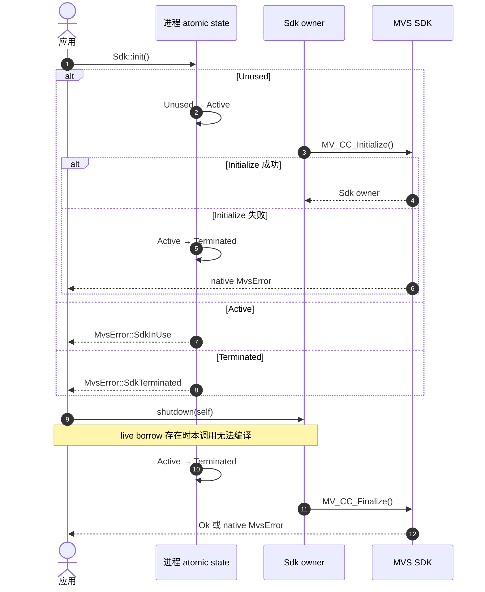

# Sdk shutdown 的终态约束

`Sdk` 是进程内唯一 owner。`DeviceList<'sdk>`、`DeviceInfo<'sdk>` 与 `Camera<'sdk>`
借用它，因此 Rust 会在编译期阻止 native 资源存活时消费 `Sdk`。

官方 CHM 限定单进程仅执行一次 Initialize 与 Finalize。Initialize 失败或 Finalize 尝试后
均进入终态，后续 `Sdk::init` 返回 `SdkTerminated`；失败路径不重试 native 调用。
