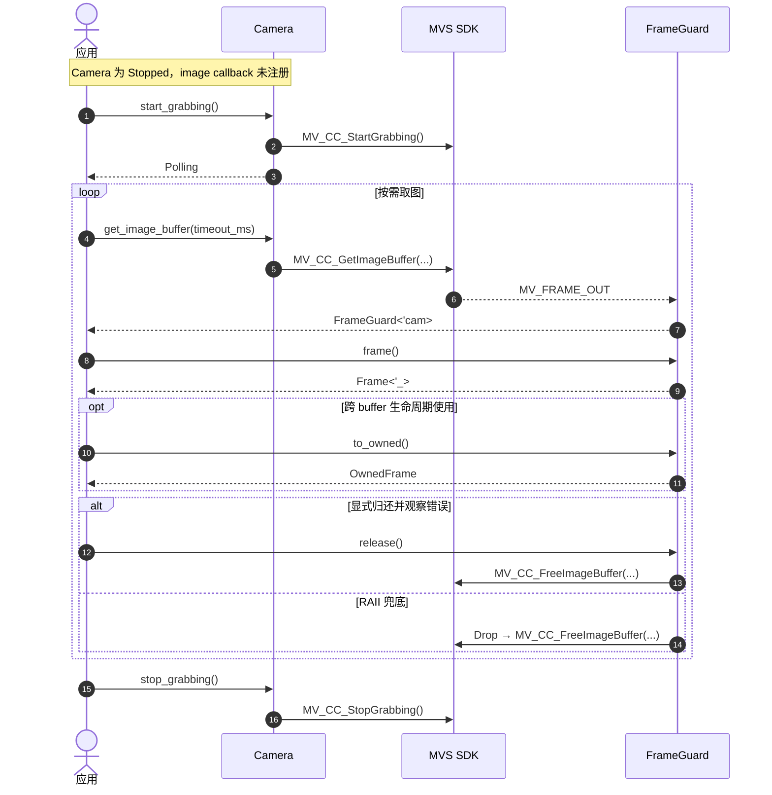

# 轮询取图与 buffer 归还

```mermaid
sequenceDiagram
    autonumber
    actor App as 应用
    participant Camera as Camera
    participant Native as MVS SDK
    participant Guard as FrameGuard

    Note over App,Camera: Camera 为 Stopped，image callback 未注册
    App->>Camera: start_grabbing()
    Camera->>Native: MV_CC_StartGrabbing()
    Camera-->>App: Polling

    loop 按需取图
        App->>Camera: get_image_buffer(timeout_ms)
        Camera->>Native: MV_CC_GetImageBuffer(...)
        Native-->>Guard: MV_FRAME_OUT
        Guard-->>App: FrameGuard<'cam>
        App->>Guard: frame()
        Guard-->>App: Frame<'_>
        opt 跨 buffer 生命周期使用
            App->>Guard: to_owned()
            Guard-->>App: OwnedFrame
        end
        alt 显式归还并观察错误
            App->>Guard: release()
            Guard->>Native: MV_CC_FreeImageBuffer(...)
        else RAII 兜底
            Guard->>Native: Drop → MV_CC_FreeImageBuffer(...)
        end
    end

    App->>Camera: stop_grabbing()
    Camera->>Native: MV_CC_StopGrabbing()
```

每个 FrameGuard 唯一负责一份 `MV_FRAME_OUT` 的归还凭据，并借用 Camera，防止 buffer
仍在使用时停止或关闭相机。

