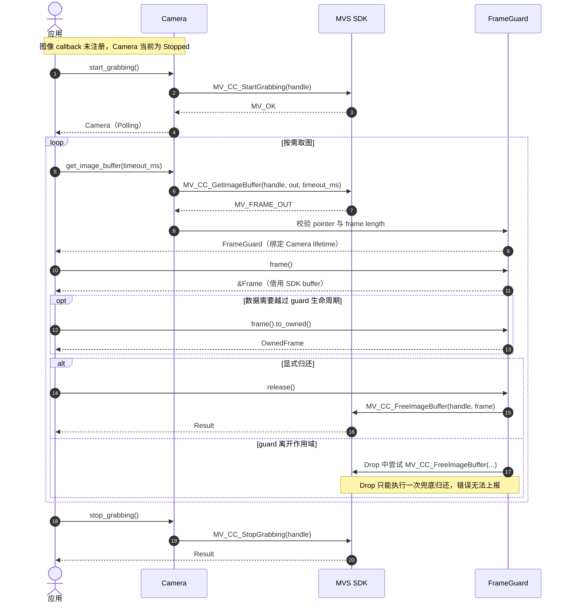

# 轮询取图与 buffer 归还

本图记录轮询模式下获取 SDK 图像 buffer、借用帧数据及归还 buffer 的调用顺序。

```mermaid
sequenceDiagram
    autonumber
    actor App as 应用
    participant Camera as Camera
    participant Native as MVS SDK
    participant Guard as FrameGuard

    Note over App,Camera: 图像 callback 未注册，Camera 当前为 Stopped
    App->>Camera: start_grabbing()
    Camera->>Native: MV_CC_StartGrabbing(handle)
    Native-->>Camera: MV_OK
    Camera-->>App: Camera（Polling）

    loop 按需取图
        App->>Camera: get_image_buffer(timeout_ms)
        Camera->>Native: MV_CC_GetImageBuffer(handle, out, timeout_ms)
        Native-->>Camera: MV_FRAME_OUT
        Camera->>Guard: 校验 pointer 与 frame length
        Guard-->>App: FrameGuard（绑定 Camera lifetime）
        App->>Guard: frame()
        Guard-->>App: &Frame（借用 SDK buffer）
        opt 数据需要越过 guard 生命周期
            App->>Guard: frame().to_owned()
            Guard-->>App: OwnedFrame
        end
        alt 显式归还
            App->>Guard: release()
            Guard->>Native: MV_CC_FreeImageBuffer(handle, frame)
            Native-->>App: Result
        else guard 离开作用域
            Guard->>Native: Drop 中尝试 MV_CC_FreeImageBuffer(...)
            Note over Guard,Native: Drop 只能执行一次兜底归还，错误无法上报
        end
    end

    App->>Camera: stop_grabbing()
    Camera->>Native: MV_CC_StopGrabbing(handle)
    Native-->>App: Result
```

