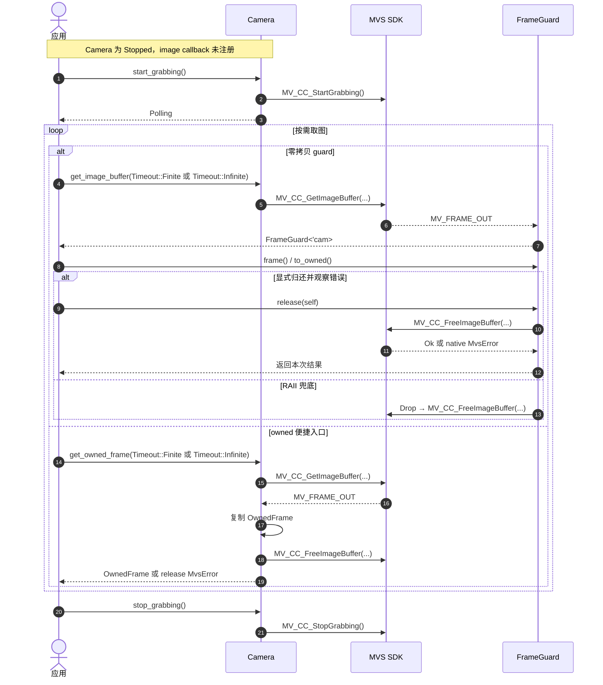

# 轮询取图与 buffer 归还

每个 `FrameGuard` 唯一负责一份 `MV_FRAME_OUT` 的归还凭据，并借用 `Camera`，防止 buffer
仍在使用时停止或关闭相机。等待时长由 `Timeout` 表达：`Finite(ms)` 为有限等待，`Infinite`
映射到 SDK 的无限等待哨兵。`release(self)` 会消费 guard 并只尝试一次，错误用于诊断和宿主策略；`Drop` 只做一次
兜底并忽略错误。归还结束后，`Camera` 再按 Stop → callback 注销 → Close → Destroy 顺序清理。
`get_owned_frame` 复用相同 guard，复制后显式归还并传播 release 错误。Destroy 未确认成功时，
live handle 会阻止 SDK Finalize。
